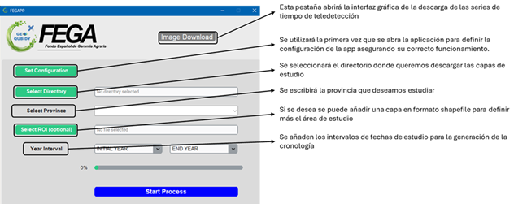
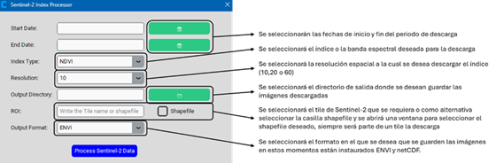

# README FEGA_DETECT

Este repositorio de GitHub se utilizará para la transferencia de la detección de abandonos y los diferentes algoritmos desarrollados por el Grupo de Investigación **GEOQUBIDY**. 

El repositorio está dividido en dos partes fundamentales:

## 1. FEGAPP
Código fuente de la aplicación desarrollada, que consta de dos módulos:

### a. SIGPAC Crono
Módulo que consiste en el cálculo de las capas procedentes de la base de datos del **SIGPAC** para obtener un seguimiento del funcionamiento de los diferentes recintos declarados.

### b. Descarga de imágenes
Este módulo permite la descarga de diferentes índices para un *tile* o una zona de estudio con Sentinel-2.

## 2. Marcadores
Parte enfocada en los marcadores y la parametrización derivada del análisis de la estabilidad y los ciclos de vegetación de los recintos de estudio.

---

## Estructura del repositorio

### 📂 `FEGAPP`

#### 📁 `Config`
Contiene la información necesaria para el correcto funcionamiento del **SIGPAC Crono**:

- **`Config.txt`**: Contiene el nombre de la base de datos en formato URL y la ubicación del OGR para la traducción a GDB (en proceso de mejora para eliminar esta necesidad).
- **`CSV_CONFIG.csv`**: Archivo CSV con la información de comunidades autónomas, años de campaña, fechas de inicio y nombre de la base de datos instalada.

#### 📁 `Img`
Carpeta con los archivos de imágenes necesarias:
- **`composición.png`**: Composición del FEGA y el grupo de investigación.

- **`IconoFegaApp.ico`**: Imagen de GEOQUBIDY.

#### 📁 `Lib`
Contiene los códigos fuente de las funcionalidades de la aplicación:

- `__init__.py`: Marca el comienzo de un paquete.
- `DESCARGA_GUI.py`: Código de la interfaz gráfica para la descarga de imágenes.
- `descarga_planet.py`: Código para la descarga de imágenes.
- `FEGA_REC_APP.py`: Algoritmos de descarga de la base de datos del SIGPAC y generación del SIGPAC Crono.
- `Stack_stacks.py`: Algoritmo para el apilado de todas las imágenes descargadas.

#### 📁 `TILES`
Carpeta con los *tiles* de Sentinel-2 necesarios para obtener la geometría correcta para la descarga de imágenes.

#### 📄 `Fega.py`
Código principal que integra todos los algoritmos dentro de una interfaz gráfica para ejecutar la aplicación.

---

## 🖥️ Interfaz gráfica

- Este módulo permite la visualización y análisis de las capas derivadas de la base de datos del **SIGPAC**.
- Permite evaluar la evolución y cambios en los recintos declarados a lo largo del tiempo.
- Los datos se pueden visualizar en diferentes formatos y escalas, facilitando la interpretación y el análisis espacial.
- Se integra con la descarga de imágenes y otros módulos de análisis.

### Procesamiento de índices Sentinel-2

- Se seleccionan las fechas de inicio y fin del período de descarga.
- Permite elegir el índice espectral deseado (NDVI, EVI, etc.).
- Se selecciona la resolución espacial de descarga (10, 20 o 60 m).
- Se define el directorio de salida para guardar las imágenes descargadas.
- Se puede ingresar un tile de Sentinel-2 o un shapefile con el área de estudio.
- Se elige el formato de salida (ENVI o NetCDF).

---

## 📌 Notas adicionales
- Se recomienda asegurarse de que los archivos de configuración están correctamente definidos antes de ejecutar la aplicación.
- Se está trabajando en mejorar la integración del sistema para evitar dependencias externas innecesarias.

---

© 2025 **GEOQUBIDY**. Todos los derechos reservados.
